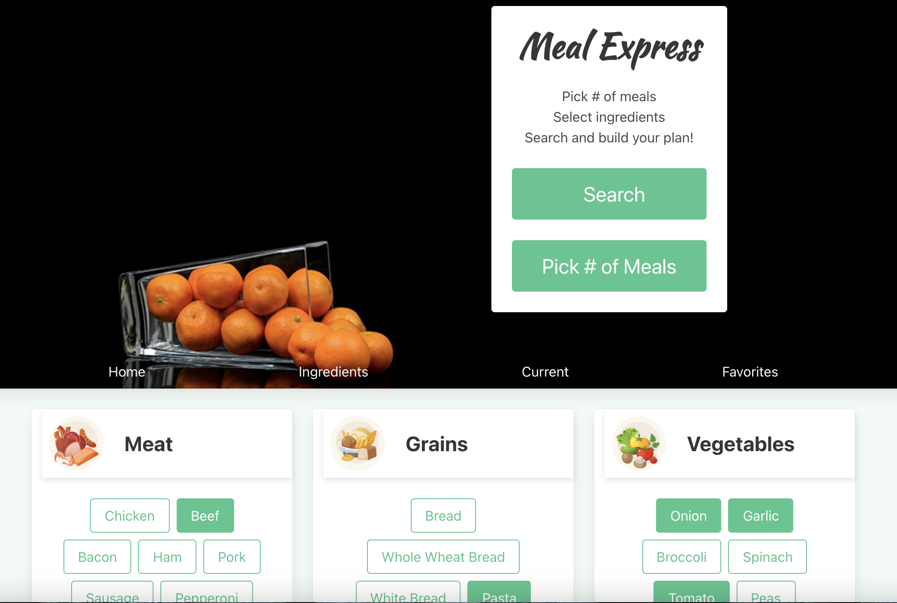

# Meal Prep Express

## User Story
AS A busy working professional interested in making my own meals I WANT a simple way to search for recipes with ingredients that I already have SO THAT I can meal prep more efficiently.

## Acceptance Criteria
GIVEN I want to find recipes in order to meal prep

WHEN I enter the ingredients I have on hand and click "search" 

THEN I receive a list of recipes that use the ingredients I specified.

WHEN I close the browser and reopen the app later

THEN I can see my previouly favorited recipes

WHEN I click the joke at the top of the page

THEN I receive a new random joke

## Image
 

## Built With
* HTML
* CSS
* Bulma 
* jQuery
* Server-side APIs

## Website
https://hguleed.github.io/mealPrepExpress/

## Made by 
Matt Dwyer, Hodan Guleed, Emily Pierson